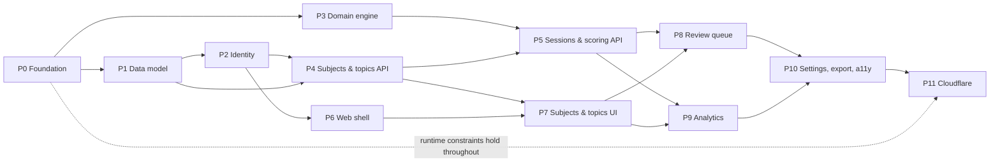

# TopicMatrix — Phased Delivery Plan

**Companion to:** [requirements.md](requirements.md) (SRS v1.0)
**Version:** 1.0
**Date:** 2026-09-05

---

## How to use this plan

Twelve phases, **P0–P11**. Each phase is scoped to be delivered by one agent in one focused work block, and each ends in a mergeable, tested, green-CI state. Requirement IDs (`FR-*`, `NF-*`, `SEC-*`, `D*`) refer to the SRS; every phase lists the ones it discharges so coverage can be audited at the end.

**Read the SRS section listed under "Spec references" before starting a phase.** The plan states *what* and *in what order*; the SRS states *why* and *to what tolerance*. Where they appear to conflict, the SRS wins — raise the conflict rather than guessing.

### Sequencing rationale

P0–P5 are backend-first. This is deliberate: the competency scoring and scheduling engine (P3) is the part of this product that can be *subtly wrong* — a UI bug is obvious, a scoring bug quietly produces plausible-looking nonsense for months. Building it early, pure, and exhaustively tested is worth deferring visible progress for. The first demoable build is **P7**; the first genuinely useful one is **P8**.

If a visible slice is needed sooner, the smallest honest reordering is to pull a cut-down P6 (shell + login) forward to sit after P2. Do not interleave P3 with UI work.

### Dependency graph



P3 is independent of P1/P2 and can run in parallel with them by a second agent. Nothing else should be parallelised.

### Definition of Done — applies to every phase

A phase is not complete until all of the following hold:

1. `npm run lint`, `npm run typecheck`, `npm run test` pass with zero warnings.
2. New backend logic has unit tests; new endpoints have integration tests covering the happy path, validation failure, unauthenticated access, and **cross-user access** (see §11.2).
3. Integration tests pass against **all configured database providers** for the phase (SQLite + PostgreSQL from P1; D1 added at P11).
4. No Node built-ins imported outside `apps/api` — the ESLint rule from P0 enforces this (NF-13).
5. No module-level mutable state or singletons holding connections/config (NF-15).
6. Requirement IDs claimed by the phase are genuinely satisfied, not stubbed. If one is deferred, record it in the phase's handover note with a reason.
7. **The T1 local loop still works**: on a clean clone, `npm install` → `npm run db:migrate` → `npm run dev` runs the app on Node against SQLite with no Docker and no Cloudflare account (FR-D.7, NF-11a). Every phase must re-verify this; it is the loop every later phase depends on.
8. A short handover note is appended to `documents/planning/progress.md`: what shipped, what was deferred, decisions taken, and anything the next phase must know.

### Conventions fixed at P0

- TypeScript `strict: true`, no `any`, no non-null assertions without a comment.
- Zod schemas in `packages/shared` are the single source of truth for request/response shapes; types are inferred from them, never hand-written twice.
- Repositories take `userId` as a mandatory first-class parameter. There is no repository method that can read another user's data.
- Pure domain logic in `packages/core` performs no I/O and receives the current time as a parameter, never calling `Date.now()` internally.
- Conventional Commits; one phase per branch; squash merge.

---

## Workspace layout (established in P0)

```
apps/
  web/          React SPA (Vite)
  api/          Node entrypoint — @hono/node-server. The ONLY place Node built-ins are allowed
  worker/       Cloudflare Workers entrypoint — exports { fetch }
packages/
  core/         Pure domain: scoring, schedulers, statuses, replay. Zero I/O, zero deps on db/http
  db/           Prisma schemas, generated clients, adapters, repositories
  api-core/     Hono app: routes, middleware, services. Runtime-agnostic
  shared/       Zod schemas, shared types, error codes, date/timezone helpers
prisma/
  model.prisma          shared model fragment
  schema.postgres.prisma  } generated
  schema.sqlite.prisma    } by
  schema.d1.prisma        } scripts/generate-schemas.ts
documents/planning/
```

This reconciles SRS §13 (which names `apps/api`, `apps/worker`) with §14.2 (which names `packages/api-core`): entrypoints are thin, routes live in `api-core`.

---

## P0 — Foundation & Runtime Spike

**Goal:** A monorepo that builds, lints, tests and deploys a health endpoint on both Node and `workerd`, with the riskiest technical unknown resolved before any product code exists.

**Depends on:** nothing.
**Spec references:** §6.3, §13, §14.2, §14.3, §14.4.
**Requirements:** NF-5 (scaffold), NF-13, NF-14, NF-15, NF-7, FR-D.2, FR-D.3, SEC-5, D12.

### Tasks

1. **Monorepo** — npm workspaces per the layout above. Root `tsconfig.base.json` with `strict`, `noUncheckedIndexedAccess`, `exactOptionalPropertyTypes`. Project references between packages.
2. **Hono app skeleton** — `packages/api-core` exports `createApp(deps: AppDeps): Hono`. `apps/api` wraps it with `@hono/node-server`; `apps/worker` exports `{ fetch: (req, env, ctx) => createApp(depsFrom(env)).fetch(req) }`. Both must serve `GET /healthz` and `GET /readyz`.
3. **Per-request dependency injection** — define `AppDeps { db, config, logger, clock, rateLimiter }`. Construct per request from the Workers `env` argument or from `process.env` in the Node entrypoint. Attach to Hono context via typed `c.var`. **No module-level singletons** (NF-15).
4. **Config validation** — Zod-validated config loader. Fails closed if `JWT_SECRET` is absent, shorter than 32 chars, or matches a known placeholder (SEC-5).
5. **Logger** — minimal `Logger` interface (`debug/info/warn/error`) writing single-line structured JSON via `console`. Request-ID middleware generating a ULID per request and including it in every log line (NF-7).
6. **Error envelope** — shared error type and Hono error middleware producing `{ error: { code, message, details? } }`. Stack traces suppressed when `NODE_ENV=production`. Error codes enumerated in `packages/shared`.
7. **Prisma multi-provider generation** — `prisma/model.prisma` holds the shared model; `scripts/generate-schemas.ts` emits the three provider schemas by prepending the correct `datasource`/`generator` blocks. Wire `DATABASE_PROVIDER` selection. At this stage the model may contain a single placeholder entity.
8. **⚠️ D1 spike — the gating task of this phase.** Stand up a throwaway D1 database via `wrangler`, run Prisma with `@prisma/adapter-d1` against it from a Worker, and measure: (a) does it work end to end, (b) compressed bundle size against the 3 MB limit (NF-14), (c) how painful is the absence of interactive transactions for a two-table write. Then do the same with `kysely-d1`. **Record the decision and the measurements in `documents/planning/adr-001-data-access.md` and commit to one library.** Everything from P1 onward assumes this answer; discovering it at P11 would be a rewrite.
9. **ESLint rule** — `no-restricted-imports` banning `node:*`, `fs`, `path`, `crypto`, `process`, `Buffer` everywhere except `apps/api/**`. This is the mechanical guarantee behind NF-13.
10. **CI** — GitHub Actions: install with `npm ci`, lint, typecheck, unit test, build both entrypoints, and a bundle-size gate on the Worker build that fails over 3 MB compressed.
11. **Local development loop (T1) — this is the baseline that must never break.** Deliver:
    - `npm run dev` — Vite dev server plus the Node API concurrently, defaulting to **SQLite** with zero configuration beyond copying `.env.example`. Vite proxies `/api` to the Node API so the browser sees one origin in development.
    - `npm run dev:pg` — the same, with `DATABASE_PROVIDER=postgresql`.
    - `npm run db:migrate`, `npm run db:reset`, `npm run db:studio`, each respecting `DATABASE_PROVIDER`.
    - `docker-compose.dev.yml` starting **only PostgreSQL** (FR-D.9), so a developer can test the PostgreSQL path without containerising the app.
    - `.env.example` covering every variable in SRS §14.1.1, with working SQLite defaults and a clearly-marked development `JWT_SECRET`.
    - README quickstart: clone → `npm install` → copy `.env.example` → `npm run db:migrate` → `npm run seed:admin` → `npm run dev`.
12. **Keep Cloudflare tooling optional (NF-11a)** — `wrangler` and `@cloudflare/vitest-pool-workers` are dev dependencies only. `npm install`, `npm run dev`, `npm run build` and the default `npm test` must all succeed with no Cloudflare account and no `wrangler login`. Worker-specific tests live behind a separate script (`npm run test:cf`) that is skipped when Cloudflare tooling is unavailable.
13. **Conditional config validation** — `DATABASE_URL` is required for `sqlite` and `postgresql` but unused for `d1`. Validate conditionally on `DATABASE_PROVIDER`; a blanket required-field check will break one target or the other.

### Acceptance criteria

- `curl localhost:8787/healthz` and `curl localhost:3000/healthz` both return `{"status":"ok"}` from the same route definition.
- **On a clean clone with no Docker running and no Cloudflare account: `npm install` → `npm run db:migrate` → `npm run dev` produces a working app against SQLite** (FR-D.7). Verify this on a fresh checkout, not on the development machine's existing state.
- Switching to PostgreSQL is `DATABASE_PROVIDER` + `DATABASE_URL` + `npm run db:migrate` — no code edit (FR-D.8).
- Deleting `apps/api` does not break the Worker build, and vice versa.
- CI fails if a Node built-in is imported into `packages/api-core`.
- ADR-001 exists and states a decision with supporting numbers.

### Risks

The spike may conclude Prisma is unviable on D1. That is a *success* for this phase, not a failure — it is exactly why the spike is first.

---

## P1 — Data Model & Persistence Layer

**Goal:** The complete schema from SRS §6, migrated on all providers, behind a repository layer that makes cross-user access structurally impossible.

**Depends on:** P0.
**Spec references:** §6.1, §6.2, §6.3, §14.4.
**Requirements:** NF-5, NF-8, NF-9, SEC-3 (storage side), §11.2 (A01 mitigation).

### Tasks

1. **Model all entities** from §6.1: `User`, `UserSettings`, `Subject`, `Topic`, `StudySession`, `ReviewSchedule`, `CompetencySnapshot`, `Tag`, `TopicTag`, `RefreshToken`. Every field listed in the SRS, with defaults.
2. **Honour §6.3 constraints without exception** — no `enum`, no `Json`, no `Decimal`, no `@db.*` native attributes, no arrays. Enum-like fields are `String` plus a TS union in `packages/shared`. `manualIntervalsJson` is `String`.
3. **Case-insensitive uniqueness** — add normalised lower-case companion columns (`nameNormalised`, `emailNormalised`) with unique constraints, since `mode: 'insensitive'` is PostgreSQL-only. Normalisation happens in one shared helper, not at call sites.
4. **Indexes** exactly as §6.2.
5. **Date storage** — all timestamps UTC. `studiedOn` and `nextReviewOn` stored as UTC midnight. Add `packages/shared/date.ts` with `startOfUserDay(instant, tz, dayStartHour)`, `toUserDate`, `addDays`. **No database date functions anywhere** (NF-9).
6. **Repository layer** in `packages/db/repositories` — one module per aggregate. Every read and write takes `userId` first and filters on it. Ownership of a nested resource is verified by joining up to the owning user, never by trusting a client-supplied id.
7. **Transaction abstraction** — a `UnitOfWork` interface. Node/PostgreSQL/SQLite implement it with interactive transactions; the D1 implementation uses batched statements. Any multi-step write must be expressible through this interface (§14.4). Design it now even though D1 is only wired at P11.
8. **Migrations** for PostgreSQL and SQLite via `prisma migrate`; generate the D1 SQL with `prisma migrate diff` and check it in (applied at P11).
9. **Foreign keys enforced** — `PRAGMA foreign_keys = ON` on every SQLite connection (NF-8).
10. **Test fixtures** — a factory module producing users, subjects, topic trees and sessions for use by all later phases. Invest here; every subsequent phase depends on it.
11. **Integration test harness** — parameterised so the same suite runs against SQLite and PostgreSQL. CI runs both (NF-5). A developer must be able to run either locally: `npm run test:integration` (SQLite, no external service) and `npm run test:integration:pg` (against `docker-compose.dev.yml`). SQLite is the default so the common path needs nothing running.
12. **Demo seed** — `npm run seed:demo` creating a realistic dataset: several subjects, a multi-level topic tree, and back-dated sessions producing a non-empty review queue and a meaningful retention curve (FR-D.10). P8 and P9 are painful to build without this, and hand-entering data wastes more time than writing it.

### Acceptance criteria

- Same test suite green on both providers.
- Both providers run locally: SQLite with nothing installed, PostgreSQL via the dev compose file.
- A test proving a repository call with user A's id cannot return user B's row, for every repository.
- Round-trip test for a date-only field across a DST boundary in a non-UTC timezone.

---

## P2 — Identity, Sessions & Access Control

**Goal:** Login works, admins manage users, and authorisation is proven correct — including on `workerd`.

**Depends on:** P1.
**Spec references:** §5.1, §11.1, §11.2, §14.2, §14.5.
**Requirements:** FR-1.1 – FR-1.11, SEC-1 – SEC-9, NF-15.

### Tasks

1. **⚠️ Argon2id benchmark — do this first.** Benchmark `hash-wasm` Argon2id inside `workerd` (`wrangler dev`) across memory/iteration settings. Find parameters meeting current OWASP guidance that fit the CPU limit. **Record results and the chosen parameters in `documents/planning/adr-002-password-hashing.md`.** If acceptable parameters do not fit the 50 ms free-tier limit, document that T3 requires a paid plan (SRS §16 Q8). **Do not weaken the hash to fit the free tier** — escalate instead.
2. **Password service** — `hash`, `verify`, `needsRehash`. Parameters from config. Minimum length 12, checked against a bundled common-password deny list (SEC-3).
3. **Token service** using `jose` — 15-minute access JWT (`sub`, `role`, `jti`, `exp`); 30-day opaque refresh token stored **hashed** in `RefreshToken`.
4. **Auth endpoints** — `POST /auth/login`, `/auth/refresh` (rotating: revoke old, issue new), `/auth/logout` (revoke), `/auth/change-password`. Refresh token set as `HttpOnly; Secure; SameSite=Strict` cookie (FR-1.3).
5. **Generic auth errors** — never disclose whether an email exists (§11.2 A07). Identical response body and comparable timing for unknown-email and wrong-password.
6. **Middleware** — `requireAuth` (verifies JWT, loads user, rejects if `isActive` false), `requireAdmin`, `requirePasswordChanged` (blocks all routes except change-password when `mustChangePassword` is true, FR-1.6).
7. **Rate limiting** — `RateLimiter` interface; in-memory implementation for Node. 10 attempts / 15 min per IP and per email (FR-1.10). Client IP resolved from the runtime's trusted source only — never raw `X-Forwarded-For`.
8. **Admin user management** — `GET/POST /admin/users`, `PATCH/DELETE /admin/users/:id`. Create with temporary password and `mustChangePassword=true`. Disable/re-enable. Delete cascades within a `UnitOfWork` (FR-1.8) — API-level typed confirmation is enforced in the UI at P6 but the endpoint requires an explicit `confirm` field.
9. **Admins cannot read learner study data** — no admin route exposes subjects, topics or sessions. Add a test asserting this (SRS §16 Q7).
10. **Seed CLI** — `npm run seed:admin`, in `apps/api` only (it may use Node built-ins). Refuses to run if any user exists (FR-1.9).
11. **Security headers + CORS** — Hono middleware applying CSP with no `unsafe-inline`, HSTS, `X-Content-Type-Options`, `Referrer-Policy` (SEC-6). CORS from a configured allow-list (SEC-7).
12. **Audit logging** — auth success/failure, admin user-management actions, account deletion: actor, action, target, timestamp. No PII beyond the user id, never credentials (§11.2 A09).

### Acceptance criteria

- Full login → access → refresh → logout cycle tested; a revoked refresh token is rejected.
- Rate limiter returns 429 after the 11th attempt in the window.
- IDOR test suite: for every existing route, user A receives 404 (not 403) for user B's resources.
- A `LEARNER` receives 403 on every `/admin/*` route.
- ADR-002 exists with benchmark numbers.

---

## P3 — Core Domain Engine

**Goal:** Scoring and scheduling, pure and exhaustively tested. **The highest-correctness-risk phase in the project.** May run in parallel with P1/P2.

**Depends on:** P0 only.
**Spec references:** §7 (all), §8 (all).
**Requirements:** FR-5.2, FR-5.4, FR-5.5, FR-5.8, NF-6, D3, D8.

Everything here lives in `packages/core`, imports nothing from `db`/`api-core`/`shared` except pure types, performs no I/O, and takes `asOfDate` as an explicit parameter.

### Tasks

1. **Types** — `SessionRecord`, `ScheduleState`, `ScoringSettings`, `SchedulerInput/Output`, `Scheduler` interface exactly as §8.5.
2. **Recency weighting** — `w = 0.5 ^ (daysAgo / 30)`, half-life configurable.
3. **Accuracy component** — recency- **and** question-count-weighted per §7.1. The `q_i` weighting is not optional; it is what stops a 2-question session outweighing a 50-question one.
4. **Confidence component** — `(c - 1) / 4`, recency-weighted.
5. **Recency component** — `R = exp(-Δt / max(I, 1))`.
6. **Composite score** — weighted sum × 100, weights validated to sum to 1.0, clamped `[0,100]`, stored to 1 dp.
7. **Edge cases (§7.2)** — zero sessions returns `null`, **never 0**; a single session is scored but flagged `provisional`; `questionsAttempted = 0` is rejected upstream and asserted against here.
8. **Roll-up (§7.3)** — weighted mean over self + descendants with ≥ 1 session, weighted by questions attempted in the trailing 180 days. Topics with no sessions are *excluded*, not counted as zero.
9. **Health status (§7.4)** and **progress status (§7.5)** — pure functions of score, schedule and settings.
10. **Grade mapping (§8.1)** — `p = 0.7a + 0.3(c−1)/4` with the `a < 0.40` floor and `a ≥ 0.90` ceiling. These guards are the point of the mapping; test them explicitly.
11. **Schedulers** — `FsrsScheduler` (wrapping `ts-fsrs`, requested retention 0.90), `Sm2Scheduler` (hand-written per §8.3, EF floor 1.3, grade→quality mapping 1/3/4/5), `ManualScheduler` (ladder advance/reset per §8.4). Registry keyed by algorithm id.
12. **Replay (§8.6)** — `replaySchedule(sessions, algorithm, settings)` folding chronologically from a null state. Must be deterministic and idempotent.

### Testing — the deliverable, not an afterthought

- Table-driven tests for every formula, including boundaries: grade thresholds at exactly 0.45/0.65/0.85, accuracy exactly 0.40 and 0.90, zero and one session, all-correct and all-incorrect.
- Property tests: score is monotonic in accuracy holding all else equal; score never leaves `[0,100]`; replay is idempotent; replaying a prefix then appending equals replaying the whole.
- SM-2 verified against published worked examples.
- FSRS verified against `ts-fsrs`'s own fixtures.
- **≥ 90% line coverage on `packages/core`, enforced in CI** (NF-6).

### Acceptance criteria

- `packages/core` has zero runtime dependencies other than `ts-fsrs`.
- No test in this phase touches a database, a clock, or a network.

---

## P4 — Subjects & Topic Tree API

**Goal:** The structural backbone — subjects and an arbitrarily deep, safely mutable topic tree.

**Depends on:** P1, P2.
**Spec references:** §5.2, §5.3, §9.
**Requirements:** FR-2.1 – FR-2.6, FR-3.1 – FR-3.11 (excluding UI-only aspects of FR-3.10).

### Tasks

1. **Subject CRUD** — `GET/POST /subjects`, `GET/PATCH/DELETE /subjects/:id`. Name 1–120 chars, unique per user case-insensitively (FR-2.2), archive flag (FR-2.3), `sortOrder`.
2. **Subject delete** — requires explicit confirmation field; cascades topics, sessions, schedules, snapshots inside a `UnitOfWork` (FR-2.4).
3. **Topic CRUD** — `GET/POST /topics`, `GET/PATCH/DELETE /topics/:id`. Sibling-unique names (FR-3.3).
4. **Materialised path maintenance** — maintain `path` and `depth` on create and move. Moving a subtree rewrites descendant paths in one batch. This is the single most bug-prone piece of P4; test it hard.
5. **`POST /topics/:id/move`** — re-parent (including across subjects, FR-3.5) and reorder. **Cycle prevention** (FR-3.4): reject a move onto self or any descendant, checked via `path`, returning a specific error code.
6. **Topic delete** — two modes: `cascade` (delete subtree) or `promote` (reparent children to the deleted node's parent), per FR-3.6.
7. **`GET /subjects/:id/tree`** — full tree with per-node metrics. **Must be depth- or page-limited** (§14.4): a hard cap of 2,000 nodes per response with a documented error beyond it.
8. **Depth warning** — the API returns `depth` so the UI can warn beyond 6 (FR-3.2). No hard limit.
9. **Tags** — tag CRUD, attach/detach, cross-subject filtering (FR-3.9).
10. **Metric roll-up wiring** — expose both a topic's *own* metrics and its *aggregate* (self + descendants) metrics as separate fields (FR-3.8), using `packages/core` roll-up from P3. If P3 is not yet merged, return `null` placeholders behind a clearly-named function and complete the wiring in P5.

### Acceptance criteria

- Building a 5-level tree, moving a mid-level node to another subject, and verifying every descendant `path` and `depth` is correct.
- Cycle attempt returns a 400 with error code `TOPIC_CYCLE`, and the tree is unchanged.
- Promote-delete leaves no orphans.
- Cross-user tests for every new route.

---

## P5 — Study Sessions, Scoring & Scheduling Integration

**Goal:** Log a result; the score and next review date update correctly, including when history is edited or back-dated.

**Depends on:** P3, P4.
**Spec references:** §5.4, §5.5, §7.6, §8.6.
**Requirements:** FR-4.1 – FR-4.8, FR-5.1, FR-5.3, FR-5.6, FR-5.7, FR-5.9, FR-5.10, FR-7.10.

### Tasks

1. **Session CRUD** — `GET/POST /topics/:id/sessions`, `PATCH/DELETE /sessions/:id`. Zod validation per FR-4.1: `studiedOn` not in the future (in the user's timezone), `questionsAttempted ≥ 1`, `0 ≤ questionsCorrect ≤ questionsAttempted`, `confidence ∈ 1..5`, `durationMinutes ≥ 0` optional.
2. **Accuracy computed server-side** on save, never accepted from the client (FR-4.2).
3. **Grade preview** — `POST /topics/:id/sessions/preview` returning the grade the mapping would produce, so the UI can show it before save and allow override (FR-5.4). The value actually used is persisted in `gradeUsed`.
4. **Recalculate-on-write** — every session create/edit/delete triggers, in one `UnitOfWork`: full chronological replay (§8.6) → updated `ReviewSchedule` → new `CompetencySnapshot` (FR-4.3, FR-4.4, FR-4.7, FR-7.10).
5. **Algorithm resolution** — topic override → subject default → user default (FR-5.3). One resolver function, used everywhere.
6. **Algorithm change** — changing a topic's algorithm re-derives the schedule from history and the response indicates dates changed, so the UI can warn (FR-5.7).
7. **Schedule overrides** — `POST /topics/:id/schedule/override` for explicit next-review date, snooze by *n* days, and suspend/unsuspend (FR-5.6, FR-5.10).
8. **Timezone-correct due dates** — all day boundaries via the user's IANA timezone and `dayStartHour` (FR-5.9). Late-night study counts toward the previous day.
9. **Score-on-read** — a service returning current scores computed as of *now* (§7.6), since the recency term decays with time. Snapshots are for history, not for current display.
10. **`GET /topics/:id/history`** — snapshots for the retention curve, date-range filterable.

### Acceptance criteria

- Log 5 sessions, delete the 2nd, and confirm the schedule and snapshots match a fresh replay of the remaining 4.
- A back-dated session inserted mid-history produces the same state as if it had been logged in order.
- A session logged at 01:00 local with `dayStartHour = 4` counts toward the previous day.
- Two topics with identical sessions but different algorithms produce different, correct next-review dates.

---

## P6 — Web Application Shell

**Goal:** A running SPA with authentication, layout, theming and a typed API client. First visible product.

**Depends on:** P2 (P4/P5 for later data screens).
**Spec references:** §5.1, §9, §13, NF-3, NF-4.
**Requirements:** FR-1.6 (UI), FR-1.7, FR-8.3, NF-3, NF-4, NF-10.

### Tasks

1. **Vite + React 18 + React Router** with route-level code splitting.
2. **Tailwind + shadcn/ui** — install the primitive set actually needed (button, input, select, dialog, table, tabs, toast, tooltip, popover, card, badge). Define the design tokens once: colour scale, spacing, the health-status palette.
3. **Typed API client** — generated from the `packages/shared` Zod schemas. Every response parsed and validated at the boundary; a schema mismatch is a loud error, not a silent `undefined`.
4. **TanStack Query** — query-key factory, sane `staleTime`, and a single place defining which mutations invalidate which keys. Getting this convention right now prevents scattered cache bugs in P7–P9.
5. **Auth flow** — login page, token in memory (never `localStorage`, SEC-2), silent refresh on 401 with request replay, logout, forced password-change screen that cannot be navigated away from (FR-1.6).
6. **Route guards** — authenticated and admin-only routes.
7. **App shell** — responsive nav (sidebar on desktop, bottom/drawer on mobile), page header slot, breadcrumbs, toast host, global error boundary.
8. **Theming** — light/dark following OS preference, user-overridable, no flash of wrong theme on load (FR-8.3).
9. **Accessibility baseline (NF-4)** — skip link, focus management on route change and dialog open/close, visible focus rings, `aria-live` for toasts. **Health status must never be colour-only** — establish an icon + text pairing component now and use it everywhere from P7 onward.
10. **Admin user management screens** — list, create (showing the temporary password once), disable, delete with typed-name confirmation (FR-1.8).
11. **Loading and empty states** — skeletons and a reusable empty-state component, used consistently from here on.

### Acceptance criteria

- Login, forced password change, navigation and logout work against the real API.
- Usable at 360 px wide; primary flows reachable by keyboard only.
- An expired access token transparently refreshes without the user noticing.

---

## P7 — Subjects & Topics UI

**Goal:** Users can build their syllabus and log results. **First genuinely usable build.**

**Depends on:** P4, P5, P6.
**Spec references:** §5.2, §5.3, §5.4.
**Requirements:** FR-2.1 – FR-2.5, FR-3.5, FR-3.9, FR-3.10, FR-4.1, FR-4.5, FR-4.6, G2.

### Tasks

1. **Subject list** — cards showing topic count, aggregate competency, due-today count, last activity (FR-2.5). Create/edit dialog with colour and icon. Archive and delete with typed confirmation.
2. **Topic tree view** — recursive, virtualised beyond ~200 visible nodes, expand/collapse with state persisted to `localStorage` (FR-3.10). Inline create-child and rename.
3. **Drag-and-drop** re-parent and reorder (`dnd-kit`), with a **keyboard-accessible alternative** — a "Move to…" dialog. DnD alone fails NF-4.
4. **Depth warning** beyond level 6 (FR-3.2), non-blocking.
5. **Delete topic dialog** offering cascade vs promote, stating exactly how many descendants and sessions are affected (FR-3.6).
6. **⚠️ Log Session form — optimise this ruthlessly (G2: under 20 seconds).** Reachable by a global shortcut and from any topic. Date defaults to today; topic pre-filled from context; confidence as a 1–5 segmented control with the SRS labels (FR-4.5); attempted/correct as numeric inputs with inline accuracy display; source and notes optional and collapsed by default. Show the computed grade with an override control (FR-5.4). Submit on Enter. Anything that adds a click here costs more than it looks.
7. **Session history table** — sortable, paginated, inline edit and delete, each triggering recalculation and cache invalidation (FR-4.6).
8. **Topic detail page** — name, notes, own vs aggregate metrics, current score, next review, session history.
9. **Tag management and cross-subject tag filter** (FR-3.9).

### Acceptance criteria

- A new user can create a subject, a 3-level topic tree and log a session without reading documentation.
- Logging a session from the topic detail page takes under 20 seconds and under 6 interactions.
- The whole tree is operable by keyboard, including moving nodes.

---

## P8 — Review Queue & Study Session Launcher

**Goal:** The product answers "what should I revise today?" — the core value proposition.

**Depends on:** P5, P7.
**Spec references:** §5.6, §5.7 (FR-7.1).
**Requirements:** FR-6.1 – FR-6.5, FR-7.1, FR-5.6, FR-5.10, FR-5.11.

### Tasks

1. **`GET /review/queue`** — Overdue / Due today / Next 7 days, ordered by overdue days descending then competency ascending (FR-7.1). Suspended and archived items excluded. Timezone-correct boundaries.
2. **`POST /review/start`** — build a filtered list by: subject; topic + descendants; due today; weakest topics (FR-6.1). Secondary filters: tag, health status, not-reviewed-in-*n*-days, score range (FR-6.2).
3. **Queue UI** — dashboard-embedded and standalone, grouped by bucket, with per-item quick actions: log, snooze, suspend.
4. **Launcher UI** — one topic at a time showing name, notes, last score, accuracy trend and next-due date, with log / skip / snooze (FR-6.3). Progress indicator.
5. **Session caps** — by item count or target minutes (FR-6.4).
6. **Resumable progress** — launcher state persisted so a refresh does not lose the run (FR-6.5). Client-side persistence is acceptable; it must not rely on server-side in-process state (NF-15).
7. **Daily maximum** with lowest-priority deferral (FR-5.11) — Could-have; implement if the phase has room, otherwise defer and note it.

### Acceptance criteria

- A topic logged today leaves the due bucket immediately and reappears on its computed next-review date.
- Weakest-first ordering matches scores computed independently in a test.
- Refreshing mid-run resumes at the same item.
- Snoozing pushes the item out by exactly *n* days without corrupting the underlying schedule state.

---

## P9 — Dashboard & Analytics

**Goal:** Make progress, weakness and forgetting visible.

**Depends on:** P5, P7.
**Spec references:** §5.7, §7.3 – §7.5.
**Requirements:** FR-7.2 – FR-7.10.

### Tasks

1. **`GET /analytics/dashboard`** — today's summary (topics reviewed, questions attempted, accuracy, minutes), streak and longest streak, 12-month activity calendar. Streak = consecutive days with ≥ 1 session in the user's timezone (FR-7.2, FR-7.3).
2. **`GET /analytics/mastery`** — competency per topic for a subject, sortable (FR-7.4).
3. **`GET /analytics/heatmap`** — tree as a colour-coded grid, with distinct treatments for *neglected* (no session ≥ `neglectThresholdDays`) and *never started*. These are different states from "low score" and must look different (FR-7.5).
4. **`GET /analytics/retention`** — snapshot series plus the modelled decay projection between reviews, with review events marked (FR-7.7). This chart is the clearest expression of the product's thesis; give it the most design attention.
5. **Topic Health View** — table of every topic with competency, last reviewed, next review, accuracy %, confidence % (`(avgConfidence − 1)/4`), review trend (▲▼▬ from the last two snapshots) and status. Sortable and filterable on every column (FR-7.6).
6. **Accuracy-vs-confidence chart** — both series on a shared time axis to expose calibration gaps (FR-7.8).
7. **Date-range selector** — 30 / 90 / 365 days / all time, applied consistently (FR-7.9).
8. **Charts** via Recharts, all with accessible text alternatives — a data table behind a disclosure for each chart (NF-4).
9. **Performance** — meet NF-1 (< 300 ms p95 at 20 subjects / 2,000 topics / 20,000 sessions). Seed a dataset of that size and measure. Add indexes or precomputation only if measurement demands it.

### Acceptance criteria

- Analytics values reconcile exactly with values computed directly from `packages/core` in tests.
- Streak logic correct across a DST transition and across the configured day-start hour.
- NF-1 met on the seeded large dataset, with numbers recorded.

---

## P10 — Settings, Data Export, Accessibility & E2E

**Goal:** Close out v1 functionality and prove quality.

**Depends on:** P8, P9.
**Spec references:** §5.8, §5.9, §10, §11.
**Requirements:** FR-8.1 – FR-8.3, FR-9.1 – FR-9.3, NF-4, NF-6, NF-12, SEC-9.

### Tasks

1. **Settings UI + `PATCH /me/settings`** — display name, timezone (IANA picker), day-start hour, default algorithm, manual interval ladder editor, neglect threshold (FR-8.1).
2. **Scoring weight tuning** — weights and health thresholds with validation that weights sum to 1.0, a live preview of the effect on a sample topic, and reset-to-defaults (FR-8.2).
3. **`GET /export/json`** — complete, versioned, lossless export (FR-9.1, FR-9.3). **Must paginate or stream internally** rather than issuing one unbounded query, so it survives D1 and Workers limits (§14.4).
4. **`GET /export/sessions.csv`** — filterable by subject and date range (FR-9.2). **CSV injection defence**: prefix any cell beginning with `= + - @` with a single quote (§11.2 A03). Test this explicitly.
5. **Accessibility audit** — automated (`axe`) plus a manual keyboard-only and screen-reader pass over every primary flow. Fix what is found. Confirm no status is conveyed by colour alone anywhere (NF-4).
6. **Playwright E2E** covering: first-run admin seed → login → forced password change → create subject and tree → log sessions → queue appears → run a launcher session → view analytics → export → change settings.
7. **Coverage gates in CI** — ≥ 90% on `packages/core`, ≥ 70% overall (NF-6).
8. **Security pass** — dependency audit gate failing on high/critical (SEC-9); verify security headers and CSP on real responses; re-run the full IDOR suite across every route added since P2.
9. **Docs** — README, a **local development guide** (T1: SQLite quickstart, switching to PostgreSQL, the dev compose database, seeding demo data, running tests per provider), a self-hosted deployment guide, backup/restore for PostgreSQL and SQLite (NF-12), and a scoring-and-scheduling explainer for users.
10. **`docker compose up`** brings up API, web and PostgreSQL from a clean checkout (NF-11).

### Acceptance criteria

- A clean clone reaches a working app via documented steps only.
- E2E suite green in CI.
- Zero critical/serious `axe` violations.
- Export re-imported by hand into a fresh database reproduces the original data (proving losslessness, even though the importer is out of scope).

---

## P11 — Cloudflare Workers Deployment

**Goal:** Deliver the optional Workers target end to end, proving the constraints held throughout were real.

**Depends on:** P10.
**Spec references:** §14 (all).
**Requirements:** FR-D.1 – FR-D.6, NF-13, NF-14, NF-15, NF-5 (D1), NF-12 (D1 backup), D12.

If P0–P10 were built to the constraints, this phase is configuration and verification. If it turns out to be a large refactor, that is a finding worth recording: the ESLint rule and per-request DI were supposed to prevent exactly that.

### Tasks

1. **`wrangler.toml`** — Worker name, compatibility date, `nodejs_compat` only if genuinely required, D1 binding, Static Assets binding, Rate Limiting binding, environments for preview and production.
2. **D1 migration pipeline** — `npm run db:migrate:d1` applying the checked-in SQL via `wrangler d1 migrations apply`. Document ordering and rollback.
3. **Wire the D1 adapter** and the `UnitOfWork` batch implementation from P1. Run the **entire** integration suite against local D1 via `@cloudflare/vitest-pool-workers`, then against a remote preview D1.
4. **Rate limiter binding implementation** — the Cloudflare-backed `RateLimiter` (NF-15), swapped in by the Worker entrypoint only.
5. **Static assets** — build the SPA into the Worker's assets directory, served same-origin so no CORS is needed (FR-D.6). SPA fallback routing for client-side routes.
6. **Secrets** — `wrangler secret put` for `JWT_SECRET` and hashing parameters. Verify nothing sensitive sits in `[vars]` (SEC-5). Confirm the config validator fails closed on a Worker with a missing secret.
7. **Bundle size** — confirm under 3 MB compressed and cold start under 200 ms p95, measured on a real deployment (NF-14). Record numbers.
8. **Argon2id parameters on Workers** — apply the ADR-002 decision; verify real login latency on the target plan.
9. **E2E against a deployed Worker preview** — the same Playwright suite from P10, unmodified (FR-D.4). Any divergence in behaviour between targets is a defect, not an acceptable difference.
10. **T4 decision** — evaluate Workers + PostgreSQL via Hyperdrive. Implement only if cheap; otherwise document it as unsupported in v1 and close SRS §16 Q10.
11. **`npm run deploy:cf`** — one command, matching `docker compose up` in convenience (FR-D.1).
12. **Cloudflare setup guide** — D1 creation, migrations, secrets, custom domain, and optional Cloudflare Access (noting per §14.5 that it is **additive only** and application auth remains mandatory) (FR-D.5).
13. **D1 backup** — `wrangler d1 export` in the backup documentation (NF-12).

### Acceptance criteria

- The same commit deploys successfully to both Docker and Cloudflare.
- **The T1 local loop is unaffected**: on a clean clone with no Cloudflare account and no `wrangler login`, `npm install` → `npm run db:migrate` → `npm run dev` still works against SQLite (FR-D.7, NF-11a). Adding the Workers target must not make Cloudflare tooling mandatory for anyone.
- The full E2E suite passes against the deployed Worker.
- No behavioural difference between targets in any functional test.
- Bundle size and cold-start numbers recorded and within limits.

---

## Requirement coverage map

| Area | Phase |
|---|---|
| FR-1.* Authentication & accounts | P2 (API), P6 (UI) |
| FR-2.* Subjects | P4 (API), P7 (UI) |
| FR-3.* Topic hierarchy | P4 (API), P7 (UI) |
| FR-4.* Study sessions | P5 (API), P7 (UI) |
| FR-5.* Scheduling | P3 (engine), P5 (integration) |
| FR-6.* Launcher | P8 |
| FR-7.* Dashboard & analytics | P8 (queue), P9 (rest) |
| FR-8.* Settings | P10 (P6 for theme) |
| FR-9.* Export | P10 |
| FR-D.* Deployment targets | P0 (constraints + T1 local loop), P11 (delivery) |
| FR-D.7 – FR-D.10 Local development | P0 (scripts, compose-db, env), P1 (demo seed, local test runs) |
| §7 Competency scoring | P3 |
| §8 Scheduling algorithms | P3 |
| NF-1 Performance | P9 |
| NF-4 Accessibility | P6 (baseline), P10 (audit) |
| NF-5 DB portability | P1, P11 |
| NF-6 Testability | P3, P10 |
| NF-13/14/15 Runtime portability | P0, P11 |
| SEC-* Security | P2, P10 |

---

## Open questions to resolve, and by when

From SRS §16. Each must be closed before the phase that depends on it.

| # | Question | Close by |
|---|---|---|
| Q9 | Prisma vs Kysely on D1 | **P0** — gates all persistence work |
| Q8 | Workers plan tier / Argon2id parameters | **P2** — gates the password service |
| Q5 | Loggable sessions with zero questions | P5 — changes FR-4.1 validation |
| Q1 | One session per source, or multiple sources per session | P5 |
| Q6 | 180-day roll-up window | P5 |
| Q3 | FSRS interval ceiling | P5 |
| Q2 | Never-started topics in the review queue | P8 |
| Q4 | Subject exam date compressing intervals | P8 — likely v1.1, but decide before queue ordering is finalised |
| Q7 | Admin visibility of study data | P2 |
| Q10 | Hyperdrive / T4 support | P11 |
| Q11 | Cloudflare Access expectation | P11 |

---

## Deferrable scope

If time pressure arrives, cut in this order. Everything here is marked **S** or **C** in the SRS.

1. FR-5.11 daily review maximum (C)
2. FR-4.8 multi-topic session logging (C)
3. FR-3.11 bulk topic creation by paste (C)
4. FR-2.6 manual subject reordering (C)
5. FR-6.4 session caps (S)
6. FR-7.8 accuracy-vs-confidence chart (S)
7. FR-8.2 scoring weight tuning (S) — keep the defaults tunable via config

**Do not cut:** anything in P3, the IDOR test suite, NF-4 baseline accessibility, or the CSV injection defence.
